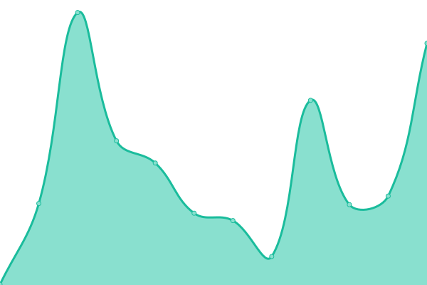
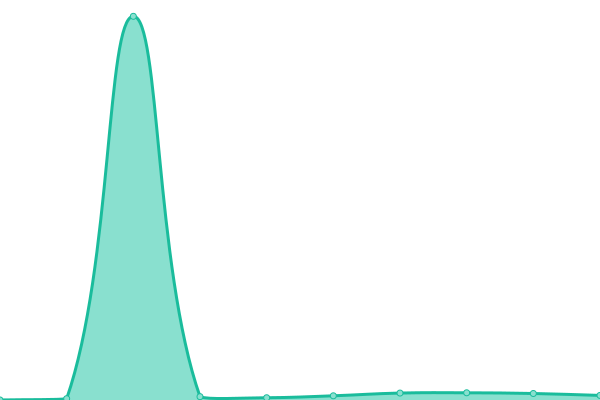
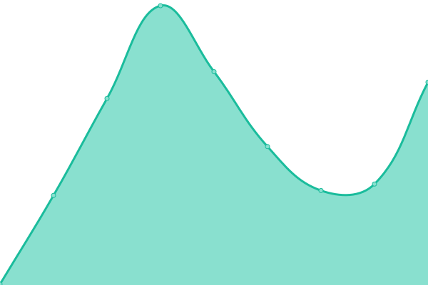
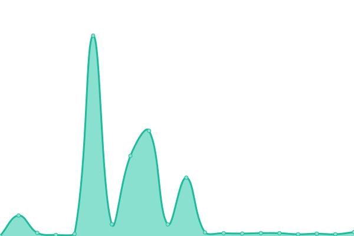
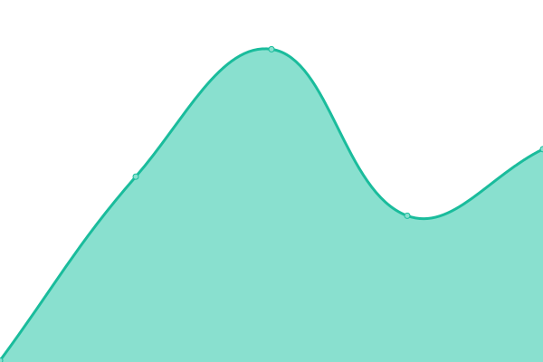

# [📈 Live Status](http://spreadsheets600.is-a.dev/Uptime-Monitor/) : <!--live status--> **🟩 All systems operational**

<!--start: status pages-->
<!-- This summary is generated by Upptime (https://github.com/upptime/upptime) -->
<!-- Do not edit this manually, your changes will be overwritten -->
<!-- prettier-ignore -->
| URL | Status | History | Response Time | Uptime |
| --- | ------ | ------- | ------------- | ------ |
|  [Cooked Roasted Life Backend](http://dono-01.danbot.host:9852/) | 🟩 Up | [cooked-roasted-life-backend.yml](https://github.com/SpreadSheets600/Uptime-Monitor/commits/HEAD/history/cooked-roasted-life-backend.yml) | 

 218ms
     
 | 

<a href="https://SpreadSheets600.github.io/Uptime-Monitor/history/cooked-roasted-life-backend">82.45%</a>
    

|  [Steam Wrapped](http://dono-01.danbot.host:9174/) | 🟩 Up | [steam-wrapped.yml](https://github.com/SpreadSheets600/Uptime-Monitor/commits/HEAD/history/steam-wrapped.yml) | 

 257ms
     
 | 

<a href="https://SpreadSheets600.github.io/Uptime-Monitor/history/steam-wrapped">82.45%</a>
    

|  [Portfolio ( Personal Website )](https://spreadsheets600.is-a.dev/) | 🟩 Up | [portfolio-personal-website.yml](https://github.com/SpreadSheets600/Uptime-Monitor/commits/HEAD/history/portfolio-personal-website.yml) | 

 224ms
     
 | 

<a href="https://SpreadSheets600.github.io/Uptime-Monitor/history/portfolio-personal-website">100.00%</a>
    

|  [PoraHobe website](http://dono-03.danbot.host:2521) | 🟩 Up | [pora-hobe-website.yml](https://github.com/SpreadSheets600/Uptime-Monitor/commits/HEAD/history/pora-hobe-website.yml) | 

 221ms
     
 | 

<a href="https://SpreadSheets600.github.io/Uptime-Monitor/history/pora-hobe-website">100.00%</a>
    

|  [Frontpage Website](http://dono-01.danbot.host:7850/frontpages) | 🟩 Up | [frontpage-website.yml](https://github.com/SpreadSheets600/Uptime-Monitor/commits/HEAD/history/frontpage-website.yml) | 

 1885ms
     
 | 

<a href="https://SpreadSheets600.github.io/Uptime-Monitor/history/frontpage-website">80.87%</a>
    

|  [Projects Monitor](http://dono-01.danbot.host:2110) | 🟩 Up | [projects-monitor.yml](https://github.com/SpreadSheets600/Uptime-Monitor/commits/HEAD/history/projects-monitor.yml) | 

 155ms
     
 | 

<a href="https://SpreadSheets600.github.io/Uptime-Monitor/history/projects-monitor">97.62%</a>
    

|  [Discord Bot Monitor](http://dono-03.danbot.host:8019) | 🟩 Up | [discord-bot-monitor.yml](https://github.com/SpreadSheets600/Uptime-Monitor/commits/HEAD/history/discord-bot-monitor.yml) | 

 187ms
     
 | 

<a href="https://SpreadSheets600.github.io/Uptime-Monitor/history/discord-bot-monitor">100.00%</a>
    

<!--end: status pages-->

## 📄 License

- Powered by: [Upptime](https://github.com/upptime/upptime)
