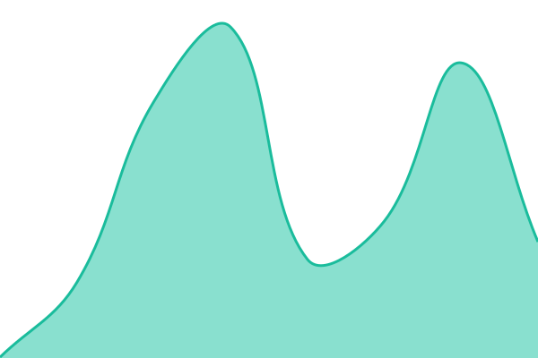
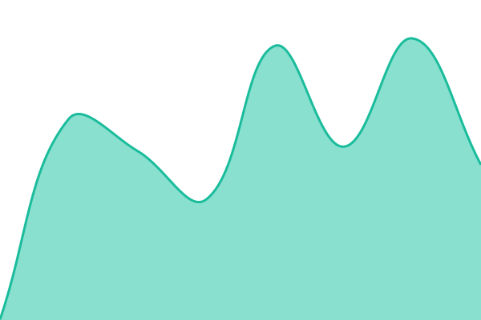
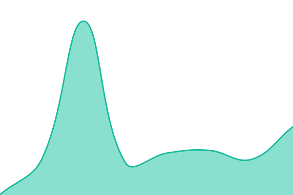

# [📈 Live Status](http://spreadsheets600.is-a.dev/Uptime-Monitor/) : <!--live status--> **🟩 All systems operational**

<!--start: status pages-->
<!-- This summary is generated by Upptime (https://github.com/upptime/upptime) -->
<!-- Do not edit this manually, your changes will be overwritten -->
<!-- prettier-ignore -->
| URL | Status | History | Response Time | Uptime |
| --- | ------ | ------- | ------------- | ------ |
|  [Portfolio ( Personal Website )](https://spreadsheets600.buzz/) | 🟩 Up | [portfolio-personal-website.yml](https://github.com/SpreadSheets600/Uptime-Monitor/commits/HEAD/history/portfolio-personal-website.yml) | 

 1095ms
     
 | 

<a href="https://SpreadSheets600.github.io/Uptime-Monitor/history/portfolio-personal-website">97.48%</a>
    

|  [Portfolio Blogs ( Blogs Website )](https://blogs.spreadsheets600.buzz/) | 🟩 Up | [portfolio-blogs-blogs-website.yml](https://github.com/SpreadSheets600/Uptime-Monitor/commits/HEAD/history/portfolio-blogs-blogs-website.yml) | 

 201ms
     
 | 

<a href="https://SpreadSheets600.github.io/Uptime-Monitor/history/portfolio-blogs-blogs-website">100.00%</a>
    

|  [Pora Hobe](https://porahobe.spreadsheets600.buzz/) | 🟩 Up | [pora-hobe.yml](https://github.com/SpreadSheets600/Uptime-Monitor/commits/HEAD/history/pora-hobe.yml) | 

 369ms
     
 | 

<a href="https://SpreadSheets600.github.io/Uptime-Monitor/history/pora-hobe">100.00%</a>
    

|  [Frontpage Generator](https://frontpage-generator.pages.dev/) | 🟩 Up | [frontpage-generator.yml](https://github.com/SpreadSheets600/Uptime-Monitor/commits/HEAD/history/frontpage-generator.yml) | 

 151ms
     
 | 

<a href="https://SpreadSheets600.github.io/Uptime-Monitor/history/frontpage-generator">100.00%</a>
    

|  [Frontpage Generator API](https://frontpage-api.spreadsheets600.workers.dev/api/stats) | 🟩 Up | [frontpage-generator-api.yml](https://github.com/SpreadSheets600/Uptime-Monitor/commits/HEAD/history/frontpage-generator-api.yml) | 

 1241ms
     
 | 

<a href="https://SpreadSheets600.github.io/Uptime-Monitor/history/frontpage-generator-api">100.00%</a>
    

|  [Unified Media API ( Movie & Shows API )](https://unified-media-api.vercel.app/) | 🟩 Up | [unified-media-api-movie-and-shows-api.yml](https://github.com/SpreadSheets600/Uptime-Monitor/commits/HEAD/history/unified-media-api-movie-and-shows-api.yml) | 

 1479ms
     
 | 

<a href="https://SpreadSheets600.github.io/Uptime-Monitor/history/unified-media-api-movie-and-shows-api">100.00%</a>
    

<!--end: status pages-->

## 📄 License

- Powered by: [Upptime](https://github.com/upptime/upptime)
